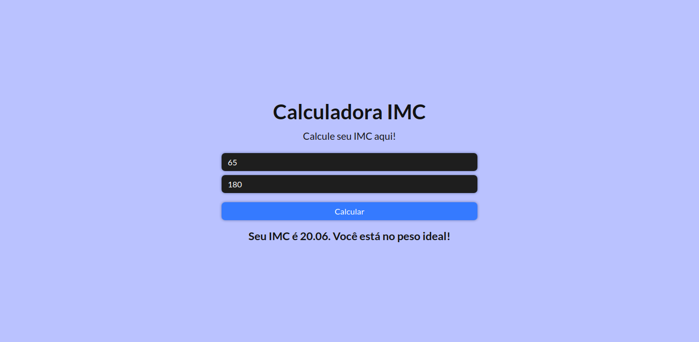

# Calculadora de IMC 
Uma calculadora de IMC bem simples feita na [Semana ReactJS](https://sujeitoprogramador.com/semana-reactjs/)

## Table of contents

- [Overview](#overview)
  - [O projeto](#o-projeto)
  - [Screenshot](#screenshot)
  - [Links](#links)
- [Processo](#processo)
  - [Tecnologias usadas](#tecnologias-usadas)
- [Autor](#autor)

## Overview

### O projeto

Projeto feito durante a primeira aula da [Semana ReactJS](https://sujeitoprogramador.com/semana-reactjs/). O usuário insere peso e altura e obtém o IMC e o seu "nível" na tabela de IMC.

### Screenshot

### Links

- [URL do Site](https://calculadora-imc-luizhf42.vercel.app/)

## Processo

### Tecnologias usadas

- HTML5
- SCSS
- JavaScript
- Vite

## Autor

- Luiz Henrique Felix. 🐢
